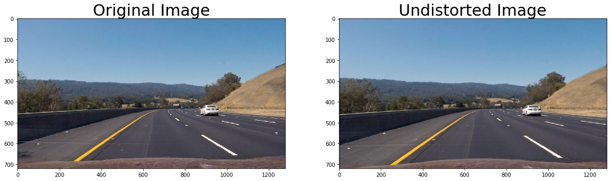
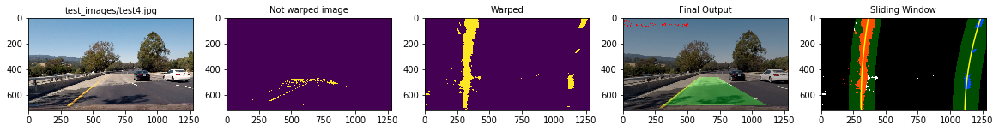

## Advanced Lane Finding Project

The goals / steps of this project are the following:

* Compute the camera calibration matrix and distortion coefficients given a set of chessboard images.
* Apply a distortion correction to raw images.
* Use color transforms, gradients, etc., to create a thresholded binary image.
* Apply a perspective transform to rectify binary image ("birds-eye view").
* Detect lane pixels and fit to find the lane boundary.
* Determine the curvature of the lane and vehicle position with respect to center.
* Warp the detected lane boundaries back onto the original image.
* Output visual display of the lane boundaries and numerical estimation of lane curvature and vehicle position.

[//]: # (Image References)

[image1]: ./examples/undistort_output.png "Undistorted"
[image2]: ./test_images/test1.jpg "Road Transformed"
[image3]: ./examples/binary_combo_example.jpg "Binary Example"
[image4]: ./examples/warped_straight_lines.jpg "Warp Example"
[image5]: ./examples/color_fit_lines.jpg "Fit Visual"
[image6]: ./examples/example_output.jpg "Output"
[video1]: ./project_video.mp4 "Video"

## [Rubric](https://review.udacity.com/#!/rubrics/571/view) Points

### Here I will consider the rubric points individually and describe how I addressed each point in my implementation.  

---

### Writeup / README

#### 1. Provide a Writeup / README that includes all the rubric points and how you addressed each one.  You can submit your writeup as markdown or pdf.  

You're reading it!

### Camera Calibration

#### 1. Briefly state how you computed the camera matrix and distortion coefficients. Provide an example of a distortion corrected calibration image.

The code for this step is contained in the second code cell of the IPython notebook located in "LaneFinding.ipynb".I
I start by preparing "object points", which will be the (x, y, z) coordinates of the chessboard corners in the world. Here I am assuming the chessboard is fixed on the (x, y) plane at z=0, such that the object points are the same for each calibration image.  Thus, `objp` is just a replicated array of coordinates, and `objpoints` will be appended with a copy of it every time.I then converted the image to grayscale and could successfully detect all chessboard corners using cv2.findChessboardCorners() in a test image.  `imgpoints` will be appended with the (x, y) pixel position of each of the corners in the image plane with each successful chessboard detection.  

I then used the output `objpoints` and `imgpoints` to compute the camera calibration and distortion coefficients using the `cv2.calibrateCamera()` function.The transformation from 3D -2D causes distortion.Inorder to correct this distortion we need the camera calibration and distortion coefficients .I applied this distortion correction to the test image using the `cv2.undistort()` function and obtained this result: 
##### Undistorted Calibration Image


### Pipeline (single images)

#### 1. Provide an example of a distortion-corrected image.
By using cv2.calibrateCamera(),we get the camera calibration -mtx and distortion coefficients dist.The mtx and dist are applied to the image to remove distortion.
##### Undistorted Test Image3


#### 2. Describe how (and identify where in your code) you used color transforms, gradients or other methods to create a thresholded binary image.  Provide an example of a binary image result.
I played around with various gradient transformation methods like Sobel operator, applying threshold to Magnitude and Direction of the gradient to extract Lane lines.The Sobel x operator worked best because it takes derivative in the x direction which helps extracting lines vertical in nature. By then applying thresholding to the Sobel applied image we can selective pick pixels that fall between particular threshold range.The threshold range selected was 35,100 after a lot of experiments.I first tried applying sobel to Grayscale image but conversion to grayscale caused a lot of information loss.Since the images had varying light conditions,using grayscale would not help.The color of the lane lines is the only feature that helps in Lane detection. So to gain maximum color information I used HSL colorspace.I applied Sobel x operator to l-channel.The next step was to apply thresholding to the V-channel to extract the white and yellow lines and remove most of the other noise.I used the threshold values 220-255.I then applied thresholding to extract the yellow lines by thresholding the hue channel.I could see the effect of each of the thresholding applied using the numpy.dstack API.This helped me tune my values.(Cell 9)

##### Color and Gradient Tranformed Test Image3


#### 3. Describe how (and identify where in your code) you performed a perspective transform and provide an example of a transformed image.

The code for my perspective transform includes a function called `corners_unwarp()`(Cell 11).The `corners_unwarp()` function takes as inputs an image (`img`).It also requires source (`src`) and destination (`dst`) points.  I chose the hardcode the source and destination points by analyzing different src and dst values on test images.Looking at different test image outputs helped me pick the correct number that worked fairly well for all test images.

```python
src = np.float32([[578,462],[701,462],[1040,680],[260,680]])
    dst = np.float32([[260,0],[1040,0],[1040,720],[260,720]])
```

This resulted in the following source and destination points:

| Source        | Destination   | 
|:-------------:|:-------------:| 
| 578, 462      | 260, 0        | 
| 701, 462      | 1040,0        |
| 1040, 680     | 1040, 720     |
| 260,680       | 260,720       |

I verified that my perspective transform was working as expected by drawing the `src` and `dst` points onto a test image and its warped counterpart to verify that the lines appear parallel in the warped image.

##### Warped Test Image3


#### 4. Describe how (and identify where in your code) you identified lane-line pixels and fit their positions with a polynomial?
The process to identify lane line pixels and fit their positions in a polynomial are as follows:
The color,gradient thresholded and warped image is passed to the find_lane_pixels(cell 13) function.Histogram of the botton half of the image is applied.This gives two peaks which are nothing but the left and right lane lines consisting of higher intensity white pixels.We calculate the left and right starting point for each peaks.

The next step is to create windows to slide over the peaks.We try to find white pixels inside the window and also recenter the window as we slide up by taking mean of the pixels found inside the window.The non zero x and y pixels for right and left peaks are appended to their respective lists.The next step is to extract x and y values from the right and left lists. To fit the positions of the extracted lane pixels we use np.polyfit.This gives us second order polynomial for left and right lane.
This step is required for the first frame.For the next subsequent frames,we simply search in a margin along  the left and right polynomial calculated from the previous step.This is implemented in function search_along_poly (Cell 14)The idea is that the lane lines do not fluctuate drastically between consequent frames. S we do not need to calculate everything from start.

##### Sliding Window Output


##### Search along Previous Polynomial


#### 5. Describe how (and identify where in your code) you calculated the radius of curvature of the lane and the position of the vehicle with respect to center.

I did this in Cell 15 ,measure_curvature.The input to this function is the left and right poly.These poly is converted to metres from pixel.The conversion ratio for y pixels in metres is  30/720 and for x pixels is 3.7/700.

I calculated the  position of the vehicle with respect to center in Cell 16,measure_distance.It takes image,left_poly and right poly as inputs. It calculates the position of the vehicle with respect to center in metres.If the value is less than 0, it indicates the vehicle is left from the center while greater than 0 indicates vehicle is right from the center.

#### 6. Provide an example image of your result plotted back down onto the road such that the lane area is identified clearly.

I implemented this step in Cell 17  in the function `draw_lanes()`. Till now we did all the ananlysis and visualization on a warped image.The draw_lanes function helps us visualize the lane lines on actual undistorted image.This function takes undistorted image,left and right polynomials and the Inverse Perspective Transformation matrix.This is required to unwarp the lane lines image on the undistorted image.A weighted addition of the images gives the following output

##### Pipeline Output


---

### Pipeline (video)

#### 1. Provide a link to your final video output.  Your pipeline should perform reasonably well on the entire project video (wobbly lines are ok but no catastrophic failures that would cause the car to drive off the road!).

###### Pipleline Output Video
Here's a [link to my video result](output_videos/project_video.mp4)

---

### Discussion

#### 1. Briefly discuss any problems / issues you faced in your implementation of this project.  Where will your pipeline likely fail?  What could you do to make it more robust?

The main issue I faced was making the video work for the part where there is shadow due to a tree on the cement road.I initially used s-channel thresholding to eliminate the shadow.The effect of shadow was more prominent on the warped image.The video worked fine except for that part.Even after lot of tweaking and using different thresholding values the video output for shadow part was not satisfactory.The lane lines would go out of the yellow and white lines.I added thresholding to V channel.The high threshold values (220-255) made sure the high intensity yellow and white pixels were not filtered.

The possible improvement in the project is to take an average of N values to smoothen out the lane lines.

